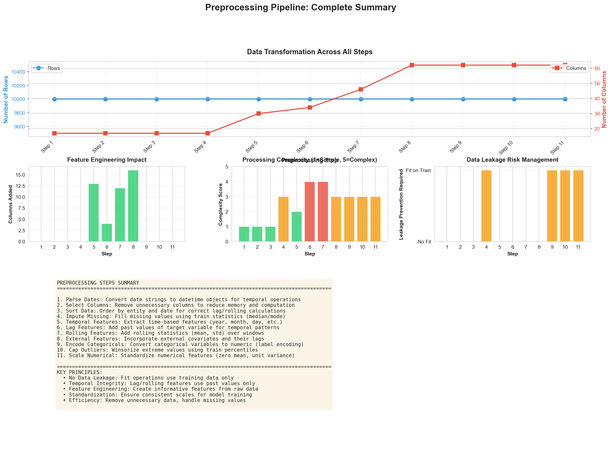

# Walmart Sales Forecasting System

A comprehensive sales forecasting system implementing research paper methodologies for retail sales prediction.

## Overview

This project implements a complete sales forecasting pipeline using retail sales datasets (Walmart from Kaggle and FreshRetailNet-50K from Hugging Face). It compares baseline models against advanced research-style models including statistical, machine learning, and deep learning approaches.

## 🆕 Preprocessing Analysis

**Comprehensive visual analysis of all 11 preprocessing steps is now available!**

- 📊 [**View Interactive Report**](preprocessing_analysis/index.html) - Open in browser for tabbed interface
- 📖 [**Read Detailed Guide**](PREPROCESSING_DETAILED_GUIDE.md) - 969 lines of in-depth explanations
- 🖼️ [**Browse Visualizations**](preprocessing_analysis/) - 12 detailed charts showing transformations
- 📝 [**Quick Summary**](PREPROCESSING_ANALYSIS_SUMMARY.md) - Overview of what's included

**What you'll find:**
- Before/after comparisons for each step
- Statistical analysis and data transformations
- Feature engineering breakdown (17 → 62 features)
- Data leakage prevention techniques
- Real-world interpretations and impacts

**View the complete pipeline summary:**



## Project Structure

```
capstone/
├── data/              # Raw and processed data
├── notebooks/         # Jupyter notebooks for analysis
│   └── sales_forecasting_pipeline.ipynb
├── src/               # Source code modules
│   ├── __init__.py
│   ├── data_loader.py      # Dataset loading
│   ├── preprocessing.py   # 11-step preprocessing (no leakage)
│   ├── eda.py              # Exploratory data analysis
│   ├── feature_engineering.py  # Feature creation
│   ├── models.py            # Model implementations
│   ├── evaluation.py        # Evaluation metrics and comparison
│   └── utils.py             # Utility functions
├── models/            # Saved model files
├── results/           # Results, plots, and comparison tables
├── requirements.txt   # Python dependencies
└── README.md          # This file
```

## Features

### Data Processing
- **11-step preprocessing** (no data leakage): parse dates, select columns, sort, impute (fit on train), temporal/lag/rolling/external features, encode categoricals (fit on train), cap outliers (fit on train), scale numericals (fit on train). 
  - 📊 **NEW:** [Complete Visual Analysis](preprocessing_analysis/) with 12 detailed visualizations
  - 📖 **NEW:** [Comprehensive Guide](PREPROCESSING_DETAILED_GUIDE.md) with before/after examples
  - 🌐 **NEW:** [Interactive HTML Report](preprocessing_analysis/index.html) for easy exploration
  - 📋 See also: [Quick Reference](docs/PREPROCESSING_11_STEPS.md)
- Automatic dataset download from Kaggle/Hugging Face
- Date parsing and sorting
- Comprehensive EDA with missing value analysis and outlier detection

### Feature Engineering
- **Lag Features**: t-1, t-2, t-4, t-12
- **Rolling Statistics**: 4, 8, 12 week means, std, max, min
- **Calendar Features**: week, month, quarter, year with cyclical encoding
- **External Variables**: Temperature, Fuel_Price, CPI, Unemployment with lagged features

### Models Implemented

#### Baseline Models
1. **Naive Forecast**: Uses last observed value
2. **Moving Average**: 4-week moving average

#### Research-Style Models
1. **SARIMA**: Seasonal AutoRegressive Integrated Moving Average
2. **Prophet**: Facebook's Prophet for time series forecasting
3. **LightGBM**: Gradient boosting framework
4. **XGBoost**: Extreme Gradient Boosting
5. **LSTM**: Long Short-Term Memory neural network

### Evaluation Metrics
- **RMSE**: Root Mean Squared Error
- **MAE**: Mean Absolute Error
- **MAPE**: Mean Absolute Percentage Error

## Installation

1. Clone the repository:
```bash
cd /Users/preet/Developer/capstone
```

2. Install dependencies:
```bash
pip install -r requirements.txt
```

## Usage

### Running the Full Pipeline

Open and run the Jupyter notebook:
```bash
jupyter notebook notebooks/sales_forecasting_pipeline.ipynb
```

The notebook will:
1. Load and preprocess the dataset
2. Perform exploratory data analysis
3. Create features
4. Train baseline and research models
5. Evaluate and compare all models
6. Generate visualizations

### Results

All results are saved in the `results/` directory:
- `model_comparison.csv`: Performance comparison table
- `sales_trends_overview.png`: EDA visualizations
- `all_predictions.png`: Prediction plots for all models
- Individual model prediction plots

### Running the FreshRetailNet-50K Pipeline (Second Dataset)

The same forecasting models run on [FreshRetailNet-50K](https://huggingface.co/datasets/Dingdong-Inc/FreshRetailNet-50K) (Hugging Face). Results are stored in a **separate folder** so Kaggle results stay unchanged.

```bash
# Use the project's virtual environment (has pandas, lightgbm, etc.)
source .venv/bin/activate
pip install -r requirements.txt   # includes 'datasets' for Hugging Face
python run_pipeline_freshretail.py
```

Or without activating: `.venv/bin/python run_pipeline_freshretail.py`

Outputs go to `results_freshretail/`:
- `model_comparison.csv`, `all_predictions.png`, `lightgbm_predictions.png`, `xgboost_predictions.png`

No synthetic or hardcoded data: the script downloads the real dataset and trains the same models (Naive, Moving Average, LightGBM, XGBoost, LSTM) on real series. By default it uses the **full dataset** (~4.5M train, ~350k eval) so validation plots show many points. If you run out of memory, set `MAX_TRAIN_ROWS` and `MAX_EVAL_ROWS` in `run_pipeline_freshretail.py` to e.g. `500_000` and `100_000`.

## Methodology

### Time-Based Splitting
The dataset is split chronologically (80% train, 20% validation) to respect temporal ordering, which is critical for time series forecasting.

### Feature Engineering
Features are created following best practices from retail forecasting research papers:
- Temporal features capture seasonality and trends
- Lag features capture short-term dependencies
- Rolling statistics capture local patterns
- External variables capture macroeconomic factors

### Model Selection
Models are selected to represent different approaches:
- **Statistical**: SARIMA, Prophet (capture seasonality and trends)
- **Tree-based**: LightGBM, XGBoost (handle non-linearities and feature interactions)
- **Deep Learning**: LSTM (capture long-term dependencies)

## Dataset

The project uses the [Walmart Store Sales Forecasting](https://www.kaggle.com/datasets/micgonzalez/walmart-store-sales-forecasting) dataset from Kaggle, which includes:
- Historical sales data by Store and Department
- External features: Temperature, Fuel Price, CPI, Unemployment
- Holiday indicators

## References

This implementation follows methodologies from:
- Retail sales forecasting research papers
- Time series forecasting best practices
- Feature engineering techniques for retail data

## License

This project is for educational and research purposes.
